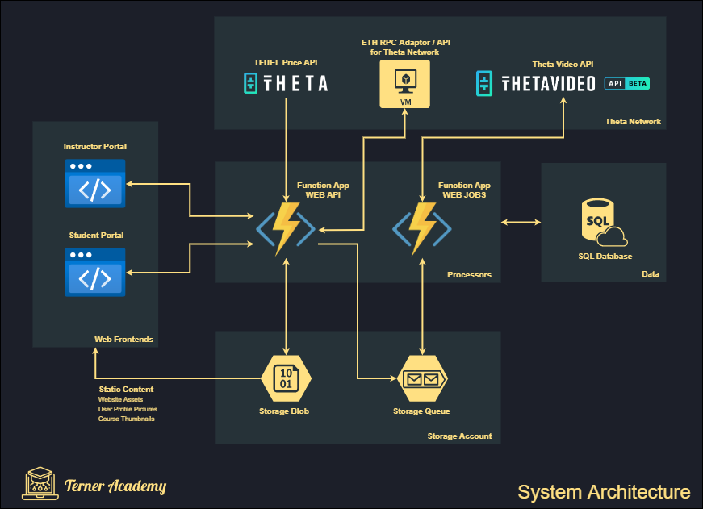

# TERNER ACADEMY

**Terner Academy** is a Blockchain-based Online Learning Platform that fully utilizes Theta Network and Theta Video API

## Features
As an instructor, they can be able to use the instructor portal & expects to:
- Creation an account
- See their latest Wallet Balance (TFuel).
- View TFuel Latest Price
- View the Dashboard
- Manage Courses (Create, Update and Publish)
- Manage Course Lessons
- View Course Reviews
- View Course Purchase/Subscription

As a student, they can be able to:
- Create an account
- See their latest Wallet Balance (TFuel).
- View TFuel Latest Price
- View Recommended Courses
- See Course Preview
- View Purchased Courses
- See Course Details
- Watch Course Lessons
- Provide Review on their Purchased Courses
- View Purchase History

## Architecture

### Technology Stack & Tools
- IDE: Visual Studio 2022 Community Edition
- Cloud Service Provider: Microsoft Azure
- Web Frontend: both Instructor Portal & Student Portal
	- Blazor Web Assembly and C# as the Programming Language
	- Azure Static Web Apps.
- Backend: For the Web API and Web JOBS 
	- C# as the Programming Language
	- Azure Function App 
- Database: 
	- Azure SQL Database (MS SQL Server)
- File Storage: Azure Storage Blob
- Queue Storage: Azure Storage Queue
- ETH RPC Adapter / API Server: Azure Virtual Machine 

## Setup Guides:
- Web API/Web Jobs Setup Guide: **See [Web API Setup Guide](src/backend/README.md)**
- Instructor Portal Setup Guide: **See [Guide](src/instructor-portal/README.md)**
- Student Portal Setup Guide: **See [Guide](src/student-portal/README.md)**

